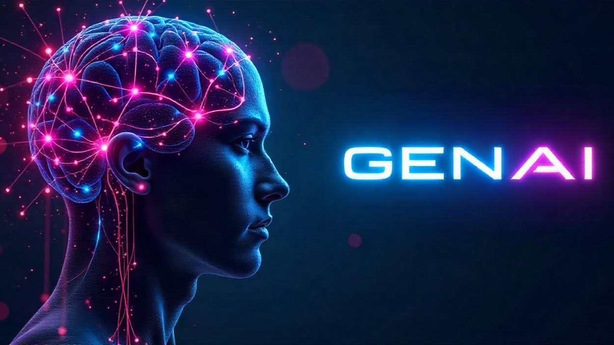
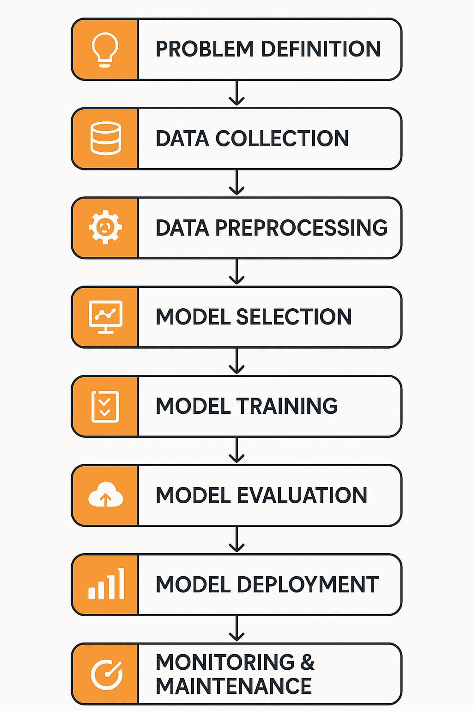

# What is Generative AI?

Generative AI refers to a type of **artificial intelligence** that creates new content like **text**, **images**, **videos**, and more. It can generate **original work** based on the data it has been trained on.

### How Does Generative AI Work?

Generative AI works by analyzing large amounts of data and learning patterns. This allows it to **create new things** that are similar to the data it has learned from, but not exact copies.

### Examples of Generative AI Tools

Some popular tools that use Generative AI include:

- **ChatGPT** – A language model that generates human-like text.
- **DALL·E** – An AI that creates images from text prompts.

For more insights on **Generative AI**, you can read my full article on [Medium here](https://medium.com/@tara378581/what-is-generative-ai-0ec6e65ddb47).
